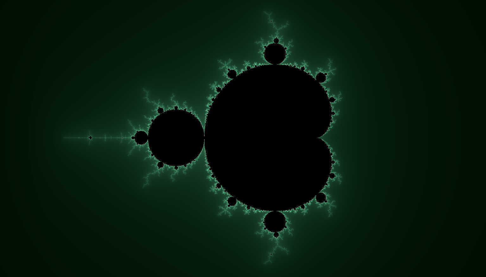

# mandelbrot viewer

## Screenshots



### Building
Install rust from [the Rust website](https://www.rust-lang.org/)

To build and run, execute the following after cloning

```
    cargo run --release
```
### Controls
Use the arrow keys to move around. 'W' and 'S' zooms 
in and out of the fractal. 'I' and 'J' change the number 
of iterations to determine convergence of elements in the
set. Thus, higher numbers of iterations increase resolution 
but require more computational resources.
